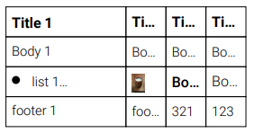
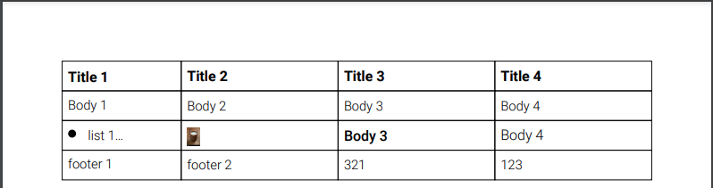
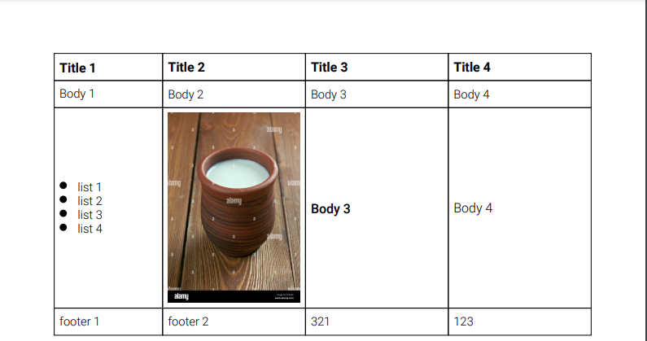

# PDF CREATOR API DOCUMENTATION

PdfCreator allows you to create your pdf files with an easier interface using the [pdf-kit](https://pdfkit.org/) package. Unlike the current pdfkit structure, it performs automatic drawing with Document Definitions (dd) prepared over json.

## Install

```
npm i auto-pdf-creator
```

## Example use

```ts
const pf = new PDFCreator(exJson.documentOptions)

pf.load({ content: exJson.content }).then(() =>{
  pf.export('base64').then((base64) => {
    console.log(base64)
  }).catch(error => console.log(error))
}) 

```


## Document Definations
<hr>

```json
{
  "documentOptions":{}, // The object containing the page general settings
  "content":[] // The object containing the components to be drawn
}
```
## Document Options
<hr>

```json
"documentOptions": {
      "size": "A4", // A1, A2, A3, A4 vb.
      "margins": {
        "top": 10,
        "left": 20,
        "bottom": 30,
        "right": 30
      },
      "margin": 50, // If this value is given, the margins value will be invalid.
      "info": {
        "Producer": "Producer",
        "Creator": "Creator",
        "Title": "Title",
        "Author": "Author"
      }
    }
```
## Page Number Options
<hr>

```ts
export interface IPageNumberOptions extends IComponentText {
  location?: 'top' | 'bottom' ; // default is 'bottom'
  type?: 'basic' | 'seperator' ; // default is 'basic'
  seperator?: string // default is '-'
  align?: 'center' | 'left' | 'right'; // default is 'right'
}
```
## Components
<hr>

* String
* List
* Image
* Table

### Base Components Options
<hr>

```ts
interface IBaseComponent {
  x?: number; // If not given specifically, the cursor value is taken.
  y?: number;
  textColor?: string; // hex color // default is black
  fontSize?: number // default is 11
  fontType?: 'light' | 'normal' | 'bold'; // default is light
  width?: number;
  height?: number;
  margin?: Array<number> | number, //margin: [left, top, right, bottom]
}
```
### String Components
<hr>

```json
{
  "content":[{
      "text": "Bu bir testtir",
      "options": {} // IComponentTextOptions (pdfkit text options)
      /* Base Options Example
      "x":0,
      "y":0,
      "textColor":"black",
      "fontSize":11,
      "fontType":"light",
      "width":100,
      "height":100,
      "margin":5,
      */
    }]
}
```
#### String Components Options
<hr>

```ts 
interface IComponentTextOptions {
  lineBreak?: boolean | undefined;
  width?: number | undefined;
  height?: number | undefined;
  ellipsis?: boolean | string | undefined;
  columns?: number | undefined;
  columnGap?: number | undefined;
  indent?: number | undefined;
  paragraphGap?: number | undefined;
  lineGap?: number | undefined;
  wordSpacing?: number | undefined;
  characterSpacing?: number | undefined;
  fill?: boolean | undefined;
  stroke?: boolean | undefined;
  link?: string | undefined;
  underline?: boolean | undefined;
  strike?: boolean | undefined;
  continued?: boolean | undefined;
  oblique?: boolean | number | undefined;
  align?: 'center' | 'justify' | 'left' | 'right' | string | undefined;
  baseline?: number | 'svg-middle' | 'middle' | 'svg-central' | 'bottom' | 'ideographic' | 'alphabetic' | 'mathematical' | 'hanging' | 'top' | undefined;
  features?: any[] | undefined;
  listType?: 'bullet' | 'numbered' | 'lettered' | undefined;
  bulletRadius?: number | undefined;
  bulletIndent?: number | undefined;
  textIndent?: number | undefined;
}
```
### List Components
<hr>

```json
{
  "content":[{
      "list": ["1. Car","2. Car","3. Car","4. Car","5. Car",],
      "options": {}, // IComponentTextOptions (pdfkit text options)
      /* Base Options Example
      "x":0,
      "y":0,
      "textColor":"black",
      "fontSize":11,
      "fontType":"light",
      "width":100,
      "height":100,
      "margin":5,
      */
    }]
}
```
### Image Components
<hr>

```json
{
  "content":[{
      "image": { 
        "url": "https://example.com/image.jpg",
        "options": {} // IComponentImageOptions
      },
      /* Base Options Example
      "x":0,
      "y":0,
      "textColor":"black",
      "fontSize":11,
      "fontType":"light",
      "width":100,
      "height":100,
      "margin":5,
      */
    }]
}
```
#### Image Components Options
<hr>

```ts
interface IComponentImageOptions {
  scale?: number | undefined;
  fit?: [number, number] | undefined;
  cover?: [number, number] | undefined;
  align?: 'center' | 'right' | undefined;
  valign?: 'center' | 'bottom' | undefined;
  destination?: string | undefined;
}
```
### Table Components
<hr>

Table Components interfaces

```ts 
export interface IComponentTableBaseOptions {
  justify?: 'top' | 'bottom' | 'center' // default is 'center'
  align?: 'center' | 'justify' | 'left' | 'right' // default is 'center'
  lineJoin?: 'miter' | 'round' | 'bevel' // default is undefined
  lineCap?: 'butt' | 'round' | 'square' // default is undefined
  dash?: { length: number, space: number } // default is undefined
  lineWidth?: number // default is 0.5
  strokeOpacity?: number // default is 1.0
  strokeColor?: string | '' // default is black
  fillOpacity?: number // default is 0
  fillColor?: string | '' // default is white
  cellMargin?: number // default is 5
}

export interface IComponentTableOptions extends IComponentTableBaseOptions {
  maxWidth?: number; // default is undefined (verilmez ise sayfa genişliği alınır)
  margins?: { top: number; left: number; bottom: number, right: number; }, // default is undefined
  isEllipsis?: boolean; // default is false
}

export interface ICellOptions extends IComponentTableBaseOptions, IComponentText, IComponentImage, IComponentList { }

export interface IComponentTable extends IBaseComponent {
  table: {
    options?: IComponentTableOptions
    widths: Array<number | '*'> // çizilecek table sütun genişlikleri (* değeri otomatik boyutlamayı sağlar)
    height?: number // satır yüksekliği // default is 25
    header?: Array<Array<number | string | ICellOptions>>
    body?: Array<Array<number | string | ICellOptions>>
    footer?: Array<Array<number | string | ICellOptions>>
  };
}
```
Table Components example
```json
{
  "content":[{
      "table": { 
        "widths":[100,"*","*","*"], // Each field is required.
        "options": {
          "align":"left",
          "maxWidth":300,
          "lineWidth": 0.3,
          "isEllipsis": true // If this value is true, the height given for the table is fixed.
        }, // IComponentTableOptions
        "header":[
          [
            { "text":"Title 1", "fontType":"bold", "fontSize":12},
            { "text":"Title 2", "fontType":"bold", "fontSize":12},
            { "text":"Title 3", "fontType":"bold", "fontSize":12},
            { "text":"Title 4", "fontType":"bold", "fontSize":12},
          ]
        ],
        "body":[
          ["Body 1", "Body 2", "Body 3", "Body 4"],
          [
            { "list":["list 1","list 2","list 3","list 4"], },
            { "image": { "url": "https://example.com/images.jpg" }},
            { "text":"Body 3", "fontType":"normal", "fontSize":12},
            { "text":"Body 4", "fontType":"", "fontSize":12},
          ]
        ],
        "footer":[  ["footer 1", "footer 2", 321, 123]  ]
      },
      /* Base Options Example
      "x":0,
      "y":0,
      "textColor":"black",
      "fontSize":11,
      "fontType":"light",
      "width":100,
      "height":100,
      "margin":5,
      */
    }]
}
```
Table ex:



Table ex: (maxWidth less)



Table ex: (isEllipsis less)



